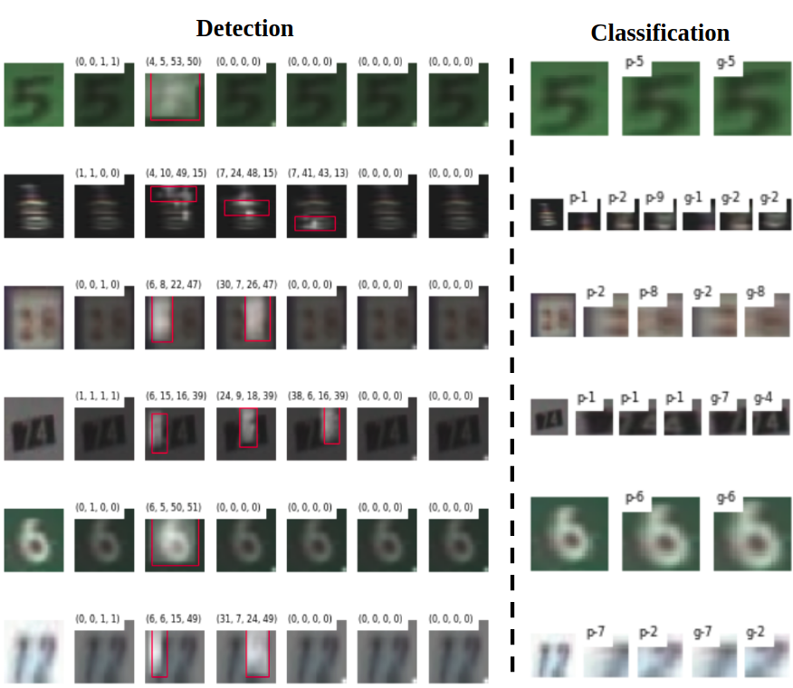

# Multi-digit detection  via attention and classification


### Preparing data
We need to prepare the raw SVHN dataset

1. Go to the cloned multi_digit_classification_attention folder and run the following command:
``` bash
mkdir dataset
```

2. Download the [SVHN](http://ufldl.stanford.edu/housenumbers/) dataset and extract the train and test SVHN data into the *dataset* folder inside *multi_digit_classification_attention* folder.

3. Select which type to data to curate and run the following command:
``` bash
python gen_crop_dataset.py --dataset_type=<train/test>
```

4. Select which type to data to generate attention mask and run the following command:
``` bash
python gen_attn_truth.py --dataset_type=<train/test>
```
### Training

1. To train detection model run the following command:
``` bash
python train.py
```

2. To train classification model run the following command:
``` bash
python train_classify_net.py
```


### Inference
To test and visualize results run the following command:
``` bash
jupyter notebook
```
and open and run:
> evaluate_and_viz.ipynb

### Next steps
1. Build a stronger classification network, maybe by training changes i.e. advanced data augmentations or using the extra dataset
2. Verify and finish up ```test_pred_seq.py```
3. Change up hyper-paramters to get better results.
